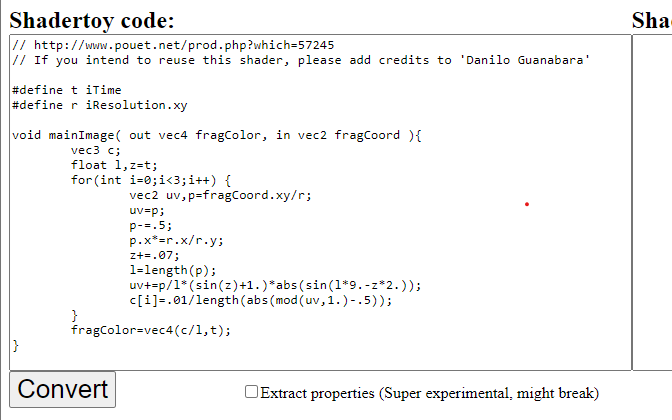
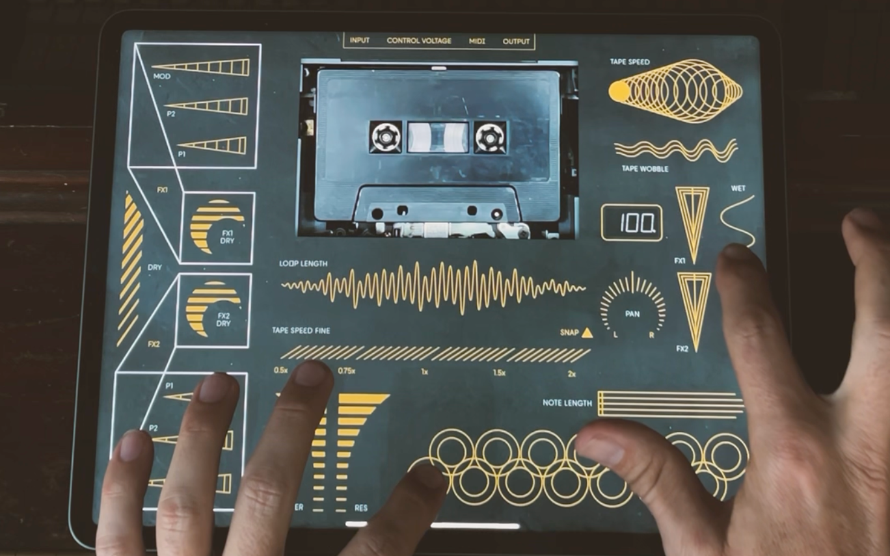

# Videolab-Resources
Compilation of many resources useful for making Videopaks for the OP-Z! Want to join the Discord Videolab Creators community? Join [here](https://discord.gg/rGvHX6W).

# Unity Resources

---
### Videolab - https://github.com/teenageengineering/videolab

Required to import into your Unity project in order to build for the OP-Z. Also contains Wiki for learning about how to use Videolab. This is official content from Teenage Engineering. 

---

### Template Unity Project - https://github.com/Videolab-Creators-Group/Videopak-Template

Not sure how to get started with Videolab? Download this pre-configured Unity project and open it with Unity Hub. Alternatively, fork that repo and create your own project already linked to Github!

---

### ShaderToy > Unity Shader Converter (glsl2hlsl) - https://pema.dev/glsl2hlsl/

A web utility for creating shaders for videopaks. I used this link a LOT to convert ShaderToy shaders into Unity Shaders.

---

# Example Videopaks
### Keijiro's Videopaks - https://github.com/keijiro/VideolabTest
   
OP-Z videolab examples. May not render graphics properly in current versions of Unity or the OP-Z app. Still a great tool for learning how to set up the nodes.

---

### Romango's Tombola and XYPak - https://github.com/Romano-Garmez/Romans-VideoPaks
   
A collection of videopaks for the OP-Z. Contains a clone of the OP-1 Tombola, as well as an XYPad and sliders that can be used to send midi to other devices.

---

### Brad the Designer's Tape Track Effects - https://github.com/Videolab-Creators-Group/Tape-Track-Videopak

A single videopak for tape-based effects with a very nice UI design.

---

# Other OP-Z Video-Related Resources
### OP-Z Gif Looper Generator - https://github.com/juliensnz/opz-gif and Gif Looper Project - https://www.synthpaks.com/collections/frontpage/products/gif-looper-template-project-beta

Create sprites for the Gif Looper Project. The Gif Looper Project is a free videopak set up like the photomatic feature of the OP-Z app.

---

### libopz - https://github.com/patriciogonzalezvivo/libopz

Reverse engineering the way the OP-Z communicates with the mobile app to develop a non-official API library for the OP-Z. Also contains an OP-Z Companion app that can run on Linux.

---

# OP-Z
### list of OP-Z guides, cheat sheets, apps and other resources - https://op-forums.com/t/a-list-of-op-z-guides-cheat-sheets-apps-and-other-resources/17669/1

List of general OP-Z related resources in the OP Forums. A good tool to have, though not videopak specific.

---
